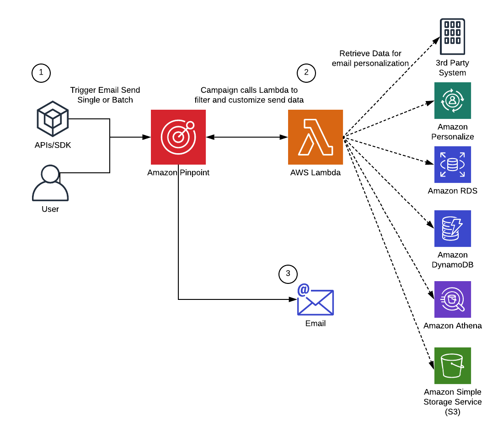

## Predictive User Engagement Workshop

Predictive User Engagement (PUE) refers to the integration of machine learning (ML) and customer engagement services. By implementing a PUE solution, you can combine ML-based predictions and recommendations with real-time notifications and analytics, all based on your customers’ behaviors.

This repository provides instructions and a simple CloudFormation Template to begin using Amazon Personalize to power recommendations in Amazon Pinpoint campaigns.

## Architecture



## Amazon Pinpoint

Amazon Pinpoint is an AWS service that you can use to engage with your customers across multiple messaging channels. You can use Amazon Pinpoint to send push notifications, emails, SMS text messages, and voice messages.

[Documentation](https://docs.aws.amazon.com/pinpoint/index.html)

## Amazon Personalize

Amazon Personalize is a machine learning service that makes it easy for developers to add individualized recommendations to customers who use their applications. It reflects the vast experience that Amazon has in building personalization systems.

[Documentation](https://docs.aws.amazon.com/personalize/)

## Prerequisites

You need the following:

* An AWS account with sufficient permissions to create the resources shown in the diagram in the earlier section. For more information about creating an AWS account, see [How do I create and activate a new Amazon Web Services account?](https://aws.amazon.com/premiumsupport/knowledge-center/create-and-activate-aws-account/).

(Optional) to deploy an Amazon Personalize Campaign, you need the following:
* Install Python 3 and the pip package manager. Python 3 is installed by default on recent versions of Linux and macOS. If it isn’t already installed on your computer, you can download an installer from the [Python website](https://www.python.org/downloads/).
* Use pip to install the following modules:
  * awscli
  * boto3
  * jupyter
  * matplotlib
  * sklearn
  * sagemaker
For more information about installing modules, see [Installing Python Modules](https://docs.python.org/3/installing/index.html) in the Python 3.X Documentation.

* Configure the AWS Command Line Interface (AWS CLI). During the configuration process, you have to specify a default AWS Region. This solution uses Amazon Sagemaker to build a model, so the Region that you specify has to be one that supports Amazon Sagemaker. For a complete list of Regions where Sagemaker is supported, see [AWS Service Endpoints](https://docs.aws.amazon.com/general/latest/gr/rande.html#sagemaker_region) in the AWS General Reference. For more information about setting up the AWS CLI, see [Configuring the AWS CLI](https://docs.aws.amazon.com/cli/latest/userguide/cli-chap-configure.html) in the AWS Command Line Interface User Guide.
* Install Git. Git is installed by default on most versions of Linux and macOS. If Git isn’t already installed on your computer, you can download an installer from the [Git website](https://www.git-scm.com/).

## Deployment Steps

### (Optional) Step 1 - Deploy an Amazon Personalize CampaignHook
To load the data into Amazon Personalize

1. At the command line, enter the following command to clone the sample data and Jupyter Notebooks to your computer:
```
git clone https://github.com/markproy/personalize-car-search.git
```
2. At the command line, change into the directory that contains the data that you just cloned. Enter the following command:
```
jupyter notebook
```
A new window opens in your web browser.

3. In your web browser, open the first notebook (**01_generate_data.ipynb**). On the Cell menu, choose Run all. Wait for the commands to finish running.
4. Open the second notebook (**02_make_dataset_group.ipynb**). In the first step, replace the value of the **account_id** variable with the ID of your AWS account. Then, on the Cell menu, choose Run all. This step takes several minutes to complete. Make sure that all of the commands have run successfully before you proceed to the next step.
5. Open the third notebook (**03_make_campaigns.ipynb**). In the first step, replace the value of the **account_id** variable with the ID of your AWS account. Then, on the Cell menu, choose Run all. This step takes several minutes to complete. Make sure that all of the commands have run successfully before you proceed to the next step.
6. Open the fourth notebook (**04_use_the_campaign.ipynb**). In the first step, replace the value of the **account_id** variable with the ID of your AWS account. Then, on the Cell menu, choose Run all. This step takes several minutes to complete.
7. After the fourth notebook is finished running, choose Quit to terminate the Jupyter Notebook. You don’t need to run the fifth notebook for this example.
8. Open the Amazon Personalize console at http://console.aws.amazon.com/personalize. Verify that Amazon Personalize contains one dataset group named **car-dg**.
9. In the navigation pane, choose Campaigns. Verify that it contains all of the following campaigns, and that the status for each campaign is Active:
  * car-popularity-count
  * car-personalized-ranking
  * car-hrnn-metadata
  * car-sims
  * car-hrnn

### Step 2: Create an Amazon Pinpoint Project
In this section, you create and configure a project in Amazon Pinpoint. This project contains all of the customers that we will target, as well as the recommendation data that’s associated with each one. Later, we’ll use this data to create segments and campaigns.

To set up the Amazon Pinpoint project

1. Sign in to the Amazon Pinpoint console at http://console.aws.amazon.com/pinpoint/.
2. On the **All projects** page, choose **Create a project**. Enter a name for the project, and then choose **Create**.
3. On the **Configure features** page, under **Email**, choose **Configure**.
4. Under **Verify an email address**, enter in your email address to verify it for sending and receiving while in the Sandbox, and then choose **Verify** and then **Save**.
5. Open your email and follow the instructions in the email sent by the service to finish verifying ownership of your address.
6. In the navigation pane, under **Settings**, choose **General settings**. In the **Project details** section, copy the value under **Project ID**. You’ll need this value later.

### Step 3: Import endpoints into a segments

1. Download the sample [pinpoint-import.csv](https://raw.githubusercontent.com/Ryanjlowe/pinpoint-personalize-workshop/master/pinpoint-import.csv) file from this repository.
2. Open the sample file and replace **[EMAILADDRESSHERE]** with the same email address you verified previously.
3. Still in the Amazon Pinpoint console, in the navigation pane, choose **Segments**, then choose **Create a segment**.
4. On the **Create a segment** screen, choose **Import a segment** at the top, then choose **Choose files**.  
5. Navigate to where you saved the **pinpoint-import.csv** file and choose **Create segment**.

### Step 4: Deploy the CloudFormation Template

The next step, we will create a CampaignHook which allows us to filter and mutate the endpoints that are targeted via a Campaign.  This [developer documentation page](https://docs.aws.amazon.com/pinpoint/latest/developerguide/segments-dynamic.html) has documentation on how to do this manually which requires knowledge of the CLI and IAM permissions.  The steps below will do this automatically and deploy a Python Lambda function stub.

1. Download the [CloudFormation template](https://raw.githubusercontent.com/Ryanjlowe/pinpoint-personalize-workshop/master/PersonalizeCampaignHookTemplate.yaml) located in this repository.
2. Sign into the Amazon CloudFormation console at https://console.aws.amazon.com/cloudformation/.
3. Choose **Create stack**.
4. Next to **Specify template**, choose **Upload a template file**, and then choose **Choose file** to upload the **PersonalizeCampaignHookTemplate.yaml** template file. Choose **Next**.
5. Under **Specify stack details**, for **Stack Name**, type a name for the CloudFormation stack.
6. Under **Parameters**, do the following:
Under **Parameters**, do the following:
  1. For **ProjectId**, enter your Amazon Pinpoint Project ID copied earlier.
  2. For **PersonalizeCampaignArn**, enter your Amazon Personalize Campaign ARN copied earlier.  If you skipped Step 1, enter in **"\*"**
7. Choose **Next**.
8. On the next page, review your settings, and then choose **Next** again. On the final page, select the box to indicate that you understand that AWS CloudFormation will create IAM resources, and then choose **Create** and wait a few minutes for CloudFormation to deploy the required components.

### Step 5: Review and Modify the Lambda Code

1. Sign into the AWS Lambda console at https://console.aws.amazon.com/lambda/
2. Choose the **PinpointPersonalizeCampaignHook** function
3. Scroll down to the **Function code** section
4. If you have the Cars Personalize Campaign deployed from optional step 1 above, uncomment out the code on lines 31-34 and comment out lines 37-41
5. If you follow the bonus points step 7 below and deploy a DynamoDB table for the item suggestions, uncomment out the code on lines 48-53 and comment out lines 56-64
6. Take note of the additional Attributes that are added to the Endpoint starting on lines 74.  These attributes do not exist in Pinpoint, but will be used to render the email.

### Step 7: Create a Pinpoint template

1. Sign back into the Amazon Pinpoint console at http://console.aws.amazon.com/pinpoint/.
2. From the **Navigation Pane** choose **Message Templates** then choose **Create a template**.
3. Select the **Email** Channel and provide a **Template Name**
4. Enter the following subject line:
```
{{User.UserAttributes.FirstName}}'s Personalized Car Recommendation!
```
5. Copy the content of the **template.html** file located in this repository [here](https://raw.githubusercontent.com/Ryanjlowe/pinpoint-personalize-workshop/master/template.html) and paste it into the **Message** section replacing the current contents.

### Step 6: Create a Pinpoint Campaign

1. From the **Navigation Pane** choose **All Projects** and select the project created from Step 2 above.
2. From the **Navigation Pane** choose **Campaigns** and choose **Create a campaign**.
3. Provide the campaign a name and choose **Email** channel and choose **Next**.
4. From the **Segment** drop down, select the segment created in Step 3 and choose **Next**.
5. Under **Message content** choose **Use an existing template** and then select the Template created in Step 7 above and choose **Next**.
6. Choose **Next** to immediately schedule the campaign to send.
7. Choose **Launch campaign** to send.

The newly created campaign will inherit the campaign hook settings that were set up in the CloudFormation template.  The campaign will trigger the Lambda function and pass in the Endpoints it targeted for the campaign.  The Lambda function will grab the UserId from the Endpoint data and call Personalize for a realtime recommendation.  Then the Lambda function will look up the recommended item details by looking in our Item database.  Finally, it will augment the Endpoint Attributes with these values and pass them back for the email rendering engine to create and send the email.

### Bonus Points Step 7: Deploy DynamoDB Table of Items

1. As a bonus step, you can take the items.csv file created in Step 1 to create a product catalog of all of the recommended vehicles.  
